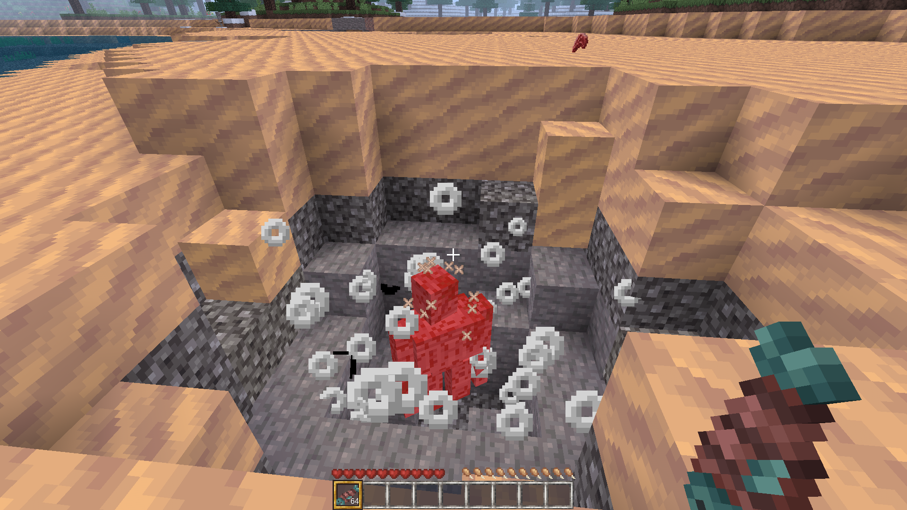

# Slapperfishy

A mod for Luanti [https://www.luanti.org](https://www.luanti.org/) that makes
fish explosive when used as a melee weapon.

Known to work with the following games:

- Minetest Game - [https://content.luanti.org/packages/Minetest/minetest_game](https://content.luanti.org/packages/Minetest/minetest_game)
- VoxeLibre - [https://content.luanti.org/packages/Wuzzy/mineclone2](https://content.luanti.org/packages/Wuzzy/mineclone2)

Note for VoxeLibre: fish slapping only works against other players.

## How to install

You can install it from ContentDB
[https://content.luanti.org/packages/ona-li-toki-e-jan-Epiphany-tawa-mi/slapperfishy](https://content.luanti.org/packages/ona-li-toki-e-jan-Epiphany-tawa-mi/slapperfishy/).

Or, you can place this directory, or symlink it, into the mods folder in your Luanti
directory.

## How to test

Dependencies:

- Lua - [https://www.lua.org](https://www.lua.org/)
- lua-language-server - [https://github.com/LuaLS/lua-language-server](https://github.com/LuaLS/lua-language-server)

There is a `flake.nix` you can use with `nix develop` to generate a development
enviroment.

Then, run the following command(s):

```sh
tools/static-analysis.lua
```
